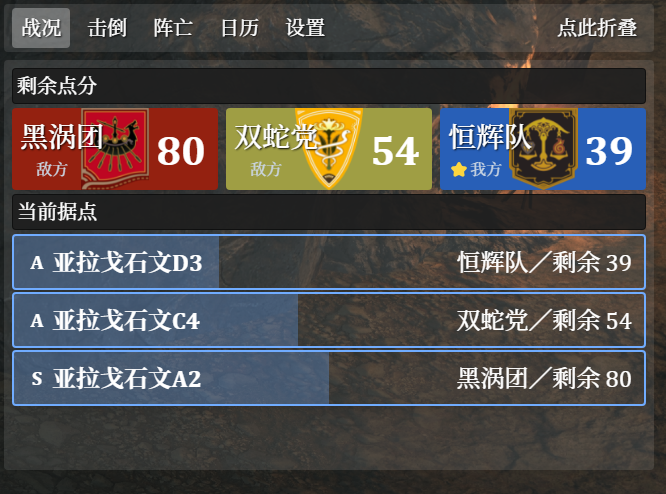
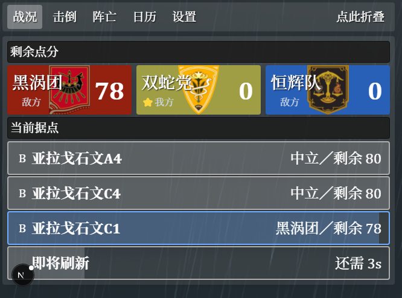
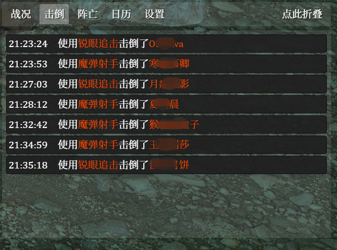
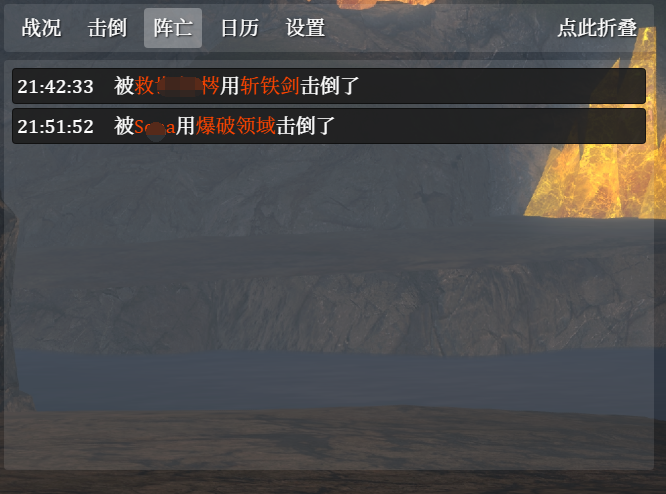
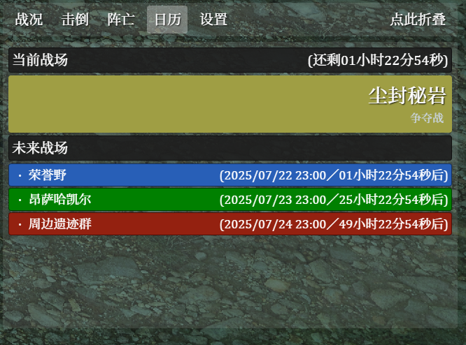

# FFXIV 纷争前线悬浮窗

专为纷争前线制作的 ACT OverlayPlugin 悬浮窗插件。

> [!TIP]\
> 专为国服简体中文客户端设计。
> 其他服务器/语言的客户端可能无法使用部分功能。

## 工作进度
此项目仍在内测阶段，功能尚不完整。

|          ＼          |          开发         |          测试         |
| :------------------: | :-------------------: | :-------------------: |
|    尘封秘岩（争夺战）   |  :white_check_mark:   |  :white_check_mark:   |
|   昂萨哈凯尔（竞争战）   |  :white_check_mark:   | :white_check_mark: |
|     荣誉野（碎冰战）     | :black_square_button: | :black_square_button: |
|   周边遗迹群（阵地战）   | :black_square_button: | :black_square_button: |

## 特色

### 实时查看刷点状况和点分预估

### 记录击倒和死亡详情

### 展示当前战场和未来战场

## 使用方法

1. 在 `OverlayPlugin` 中新建悬浮窗，类型选择 `自定义悬浮窗`；
2. 将悬浮窗地址设置为 `https://infsein.github.io/frontline-overlay/`；
3. 按照喜好调整悬浮窗位置、大小和缩放。

## 开源许可

目前并未设置开源许可，仅供社区进行安全性审查。 
未经特别授权，不得修改／再分发此项目。 
严禁将此项目用于商业用途。
