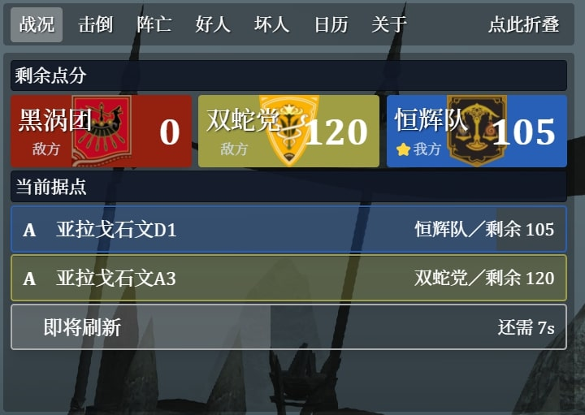
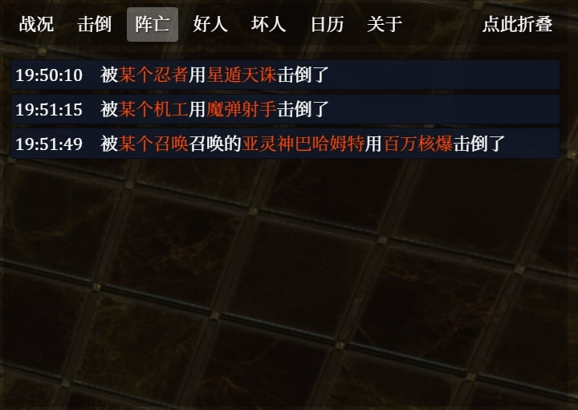
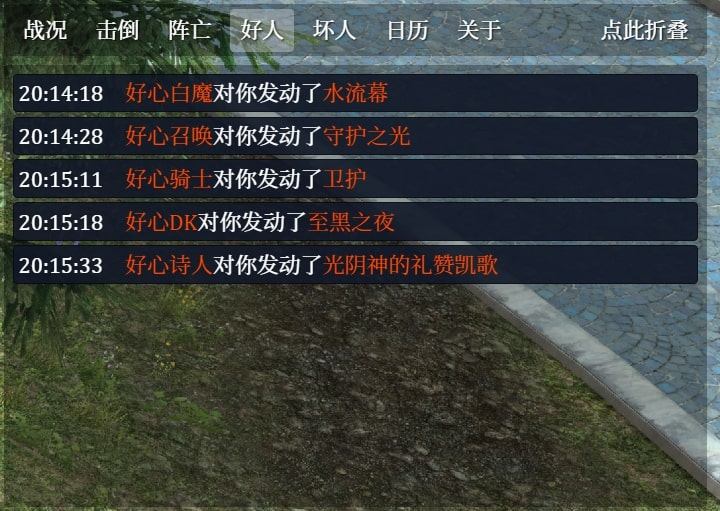
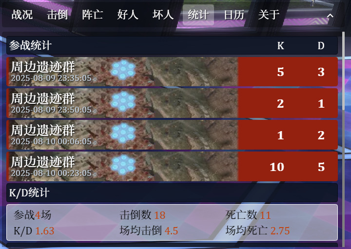
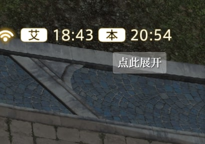

# FFXIV PvP悬浮窗

专为 最终幻想XIV PvP 玩法制作的 ACT OverlayPlugin 悬浮窗插件。

一开始只支持纷争前线，所以叫 <code>**frontline**-overlay</code> 。 
在 `v1.3.0` 之后支持解析水晶冲突。 
在 `v1.4.0` 之后支持解析烈羽争锋。

> [!TIP]\
> 仅为国服简体中文客户端设计。 
> 其他服务器／语言的客户端可能无法正常使用部分功能。

## 工作进度

这里的进度指的是「战况」面板解析的开发进度。 
「击倒」「阵亡」「好人」「坏人」「统计」面板已经支持解析全部的纷争前线／烈羽争锋／水晶冲突。

|          ＼          |          开发         |
| :------------------: | :-------------------: |
|    尘封秘岩（争夺战）   |   :white_check_mark:    |
|   昂萨哈凯尔（竞争战）   |  :white_check_mark:   |
|     荣誉野（碎冰战）     | :black_square_button: |
|   周边遗迹群（阵地战）   |   :white_check_mark:   |
|        烈羽争锋        | :black_square_button: |
|        水晶冲突        | :black_square_button: |

## 主要功能

下方截图部分来自早期版本，实际安装后的UI细节可能与其有所差异。

<table>
  <tr>
    <th colspan="2"><strong>实时查看刷点状况和点分预估</strong></th>
  </tr>
  <tr>
    <td></td>
    <td></td>
  </tr>
  <tr>
    <th><strong>记录击倒详情</strong></th>
    <th><strong>记录死亡详情</strong></th>
  </tr>
  <tr>
    <td></td>
    <td></td>
  </tr>
  <tr>
    <th><strong>记录受到的关键援护技能</strong></th>
    <th><strong>记录受到的关键阻碍技能</strong></th>
  </tr>
  <tr>
    <td></td>
    <td></td>
  </tr>
  <tr>
    <th colspan="2"><strong>记录、统计和分析本日战绩</strong></th>
  </tr>
  <tr>
    <td></td>
    <td></td>
  </tr>
  <tr>
    <th><strong>展示当前战场和未来战场</strong></th>
    <th><strong>自由折叠以减少占用</strong></th>
  </tr>
  <tr>
    <td></td>
    <td></td>
  </tr>
</table>

## 使用方法

1. 在 `OverlayPlugin` 中新建悬浮窗，类型选择 `自定义悬浮窗`；
2. 将悬浮窗地址设置为 `https://infsein.github.io/frontline-overlay/`；
3. 按照喜好调整悬浮窗位置、大小和缩放；
4. 可以点击右上方的设置按钮调整一些你需要或喜欢的选项；
5. 后续悬浮窗发布新版本时，在 `关于` 选项卡进行检查和更新。

### 本地调试

* 在第2步将悬浮窗地址设置为 `http://localhost:3000` 即可。

## 开源许可

目前并未设置开源许可，仅供社区进行安全性审查。 
未经特别授权，不得修改／再分发此项目。
> [!CAUTION]\
> 严禁商用。
